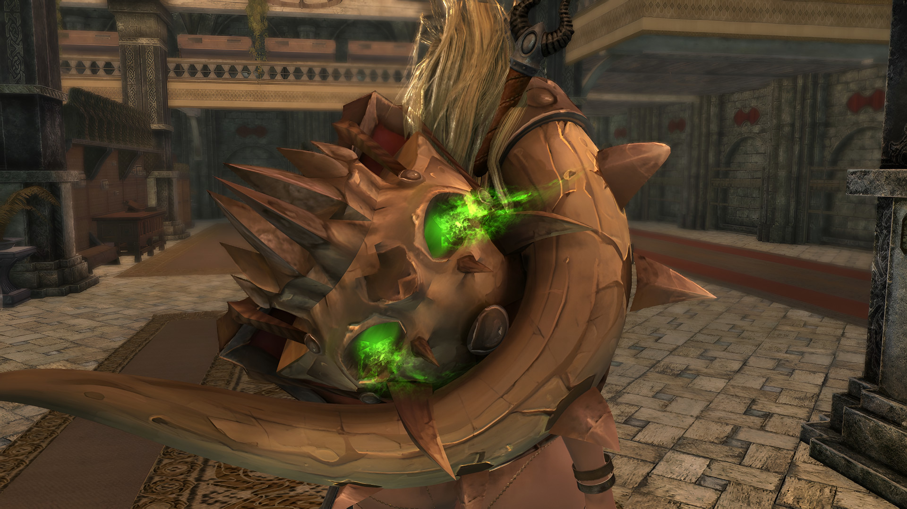
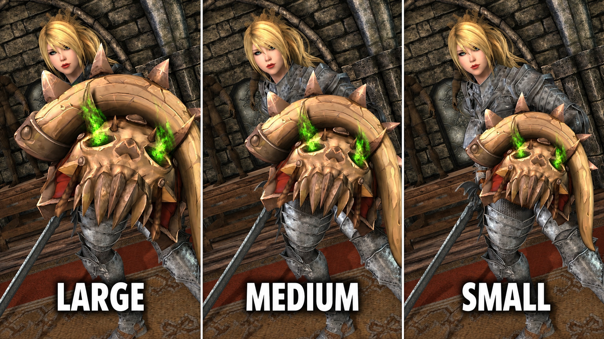
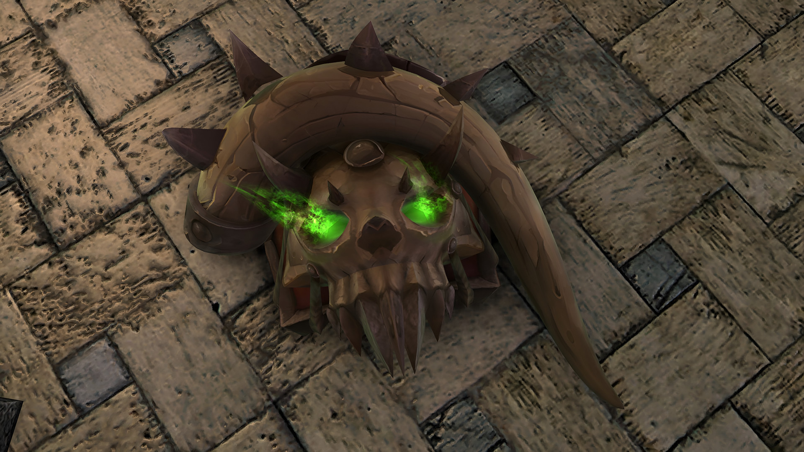
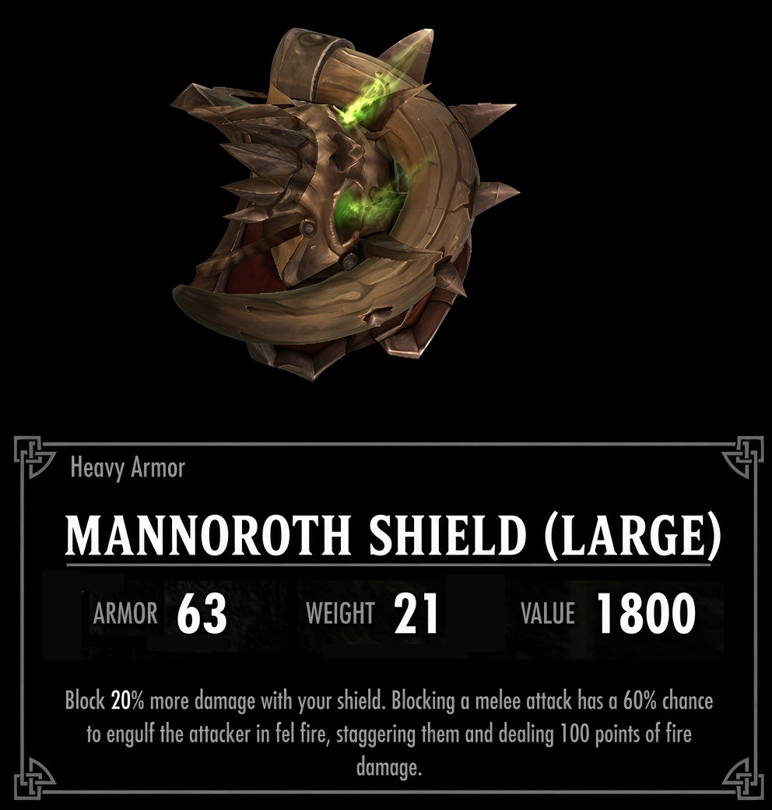

# Mannoroth Shield for Skyrim SE/AE

A Skyrim Special Edition and Anniversary Edition port and remaster of
[Tusk of Mannoroth standalone shield](https://www.nexusmods.com/skyrim/mods/74030) by **SamyFrench** (Skyrim LE,
2016). The shield comes in three sizes, with a smoother model, a real handle, first-person models, fel fire burning
in the skull's eyes, a custom enchantment and simple forge recipes.



**[Download the latest release](https://github.com/71Kevin/mannoroth-shield-se/releases/latest)**: 2K and 4K
packages, see [Downloads](#downloads).

## Features

- **Three sizes**: Small, Medium (the original size) and Large, each with its own mesh, collision, first-person
  model and recipes.
- **Fel fire eyes**: green fel fire burns in both eye sockets of the skull, with animated flames rising out of them.
- **Handle**: the shield has a grip where the hand holds it (the vanilla iron shield handle).
- **First-person models**: at rest the rim and tusk show at the lower left of the screen; when blocking, the shield
  covers the view like a vanilla shield.
- **Smoother model**: converted to Skyrim SE, normals and collision rebuilt, and the mesh subdivided so the tusk and
  skull are round while the spikes stay sharp.
- **Textures**: the original 512 px texture upscaled, with a new normal map, reflection mask and glow map, in two
  packages (2K and 4K).
- **Blood of Mannoroth** enchantment: Fortify Block 20% and Fel Rebuke, a chance to set melee attackers on fire when
  you block.
- **Simple crafting**: any forge, 2 Orichalcum Ingots, no perk needed.
- ESL-flagged plugin that only adds new records. No SKSE needed.

<p align="center">
  
</p>

<p align="center">
  
  
</p>

## Downloads

Install **one** package. Both contain the same plugin, meshes and script; only the texture size changes.

| Package | Diffuse and normal map | Download (version 1.0) |
|---|---|---|---|
| 2K | 4096 px | [Mannoroth-Shield-SE-2K-1.0.7z](https://github.com/71Kevin/mannoroth-shield-se/releases/download/v1.0/Mannoroth-Shield-SE-2K-1.0.7z) (26.3 MB) |
| 4K | 8192 px | [Mannoroth-Shield-SE-4K-1.0.7z](https://github.com/71Kevin/mannoroth-shield-se/releases/download/v1.0/Mannoroth-Shield-SE-4K-1.0.7z) (107.2 MB) |

The source texture is a 512 px painting, so the labels describe the detail you see rather than the file size: the
4096 px set looks like a 2K texture and the 8192 px set like a 4K one. Release notes and SHA-256 checksums:
[v1.0](https://github.com/71Kevin/mannoroth-shield-se/releases/tag/v1.0).

### Mod pages

| Page | Link |
|---|---|
| GitHub Releases | [All releases](https://github.com/71Kevin/mannoroth-shield-se/releases) |
| Dwemer Mods | [Mannoroth Shield - SE AE Port and Remaster](https://dwemermods.com/mods/4807) |
| Original mod (Skyrim LE) | [Tusk of Mannoroth standalone shield on Nexus Mods](https://www.nexusmods.com/skyrim/mods/74030) |

## Requirements

- Skyrim Special Edition or Anniversary Edition. Built and tested on version 1.6.1170.
- Nothing else: no SKSE, no DLC and no other mods. The only master is `Skyrim.esm`.

## Installation

- **Mod Organizer 2**: *Install a new mod from an archive*, pick the package, then enable the mod and
  `[Tinesh] Mannoroth Shield.esp`.
- **Vortex**: drag the package onto the *Mods* page (or use *Install From File*), then enable and deploy.
- **Manual**: extract the package into the game's `Data` folder and enable the plugin.

The archive holds the `Data` folder's contents (plugin, `meshes`, `textures`, `Scripts`, `Source`), so mod managers
install it without asking for a data folder. To switch texture packages, uninstall one and install the other. The
plugin is ESL-flagged and only adds records, so its place in the load order does not matter.

## Getting the shield

| Item | Armor | Weight | Value | Forge recipe | Tempering |
|---|---|---|---|---|---|
| Mannoroth Shield (Small) | 30 | 12 | 900 | 2 Orichalcum Ingots | 1 Orichalcum Ingot |
| Mannoroth Shield (Medium) | 34 | 16 | 1100 | 2 Orichalcum Ingots | 2 Orichalcum Ingots |
| Mannoroth Shield (Large) | 38 | 21 | 1300 | 2 Orichalcum Ingots | 3 Orichalcum Ingots |

Base values; the inventory shows them with your perks applied. All three are heavy shields, made at any blacksmith
forge with no perk needed and tempered at a workbench (as enchanted items, they need the Arcane Blacksmith perk).
They can also be added with the console: `help mannoroth 4`, then `player.additem <ID> 1`.

### Enchantment: Blood of Mannoroth

- **Fortify Block 20%**: block 20% more damage with your shield.
- **Fel Rebuke**: blocking a melee attack has a 60% chance to engulf the attacker in green fel fire, staggering them
  and dealing 100 points of fire damage (fire resistance applies). At most once every 3 seconds; it does not trigger
  on allies, on non-hostile actors or during brawls.

The enchantment cannot be learned by disenchanting, like the vanilla artifacts.

## Compatibility

- Adds new records only and changes no vanilla record.
- The handle uses the vanilla iron shield textures, so iron shield retextures also change the handle.
- With mods that show shields on the back, check the Large size with capes.
- The XPMSSE female skeleton shows shields at 85% size on female characters.
- First person was tested with Improved Camera SE.

## Changes from the original

- Mesh converted to Skyrim SE, one per size (0.8, 1.0 and 1.25 times the original, scaled around the attach point).
- Triangle soup welded and normals rebuilt (the stored normals did not match the faces, so the shield rendered dark
  and faceted); mesh subdivided with creases, from 922 to 19,728 triangles.
- Collision rebuilt from the shield's own shape (the original used the vanilla ebony shield's collision).
- Absolute texture paths made relative.
- Normal map rebuilt for this texture (the original reused the vanilla ebony shield's normal map).
- Plugin rebuilt for Skyrim SE: form version 44, ESL-flagged, only `Skyrim.esm` as master, the original FormIDs of the
  shield, its armor addon and recipes kept.
- The armor addon includes the vampire races, so the shield no longer disappears on vampire characters.
- Stats rebalanced (the original had 76 armor, weight 28 and value 5750).

Full history: [CHANGELOG.md](CHANGELOG.md).

## Building from source

The repository holds the build pipeline, not the original files. `build.ps1` rebuilds both packages from the original
Skyrim LE archive and the vanilla game files.

1. Download `MannorothShield-74030-1-1.rar` from the [original mod page](https://www.nexusmods.com/skyrim/mods/74030)
   and put it in `original\`.
2. Install the tools: Blender 4.3 with PyNifly, Python 3 with NumPy, Pillow, OpenCV and lz4, texconv (DirectXTex),
   the .NET 9 SDK, 7-Zip and the Creation Kit (for the Papyrus compiler).
3. Run the build from PowerShell:

   ```powershell
   .\build.ps1                     # both packages in dist\
   .\build.ps1 -Install            # also installs the 4K package into the Mod Organizer 2 mod folder (MO2 closed)
   ```

   Tool and game locations are parameters (`-Game`, `-Blender`, `-SevenZip`, `-Upscaler`, `-ModFolder`). Upscaled
   intermediates are kept in `cache\` and reused, so `-Upscaler` is only needed on the first build.

| Path | Contents |
|---|---|
| `build.ps1` | One-command build: original archive to meshes, textures, script, plugin and packages |
| `tools/build_meshes.py` | Meshes: subdivision, handle, sizes, first-person models, fel fire effects (Blender + PyNifly) |
| `tools/make_textures.py` | Texture sets: diffuse, normal map, reflection mask and glow map in BC7 |
| `tools/eye_socket.json` | Where the eye socket sits in the texture |
| `tools/lib/` | Shared helpers: LE to SE mesh conversion, BSA reader, normal map builder, `.pex` cleanup |
| `plugin/` | Plugin generator (C#, Mutagen) |
| `scripts/` | Papyrus source of the Fel Rebuke effect |
| `docs/` | Screenshots and the release checklist |

## Credits and permissions

- **SamyFrench**: original mod, model and textures
  ([Tusk of Mannoroth standalone shield](https://www.nexusmods.com/skyrim/mods/74030)).
- **Blizzard Entertainment**: the design is based on the *Tusks of Mannoroth* from World of Warcraft.
- **Bethesda Game Studios**: the vanilla iron shield handle and the vanilla effects and textures the shield uses.
- **Tinesh**: SE/AE port and remaster.
- Tools: Blender, PyNifly, Mutagen, DirectXTex, the Papyrus Compiler from the Creation Kit, 7-Zip.

The model and textures in the release packages come from the original mod and remain the property of their
respective owners; they are not part of the source code in this repository. World of Warcraft is a trademark of
Blizzard Entertainment, Inc. This is a free, non-commercial fan project, not affiliated with or endorsed by Blizzard
Entertainment or Bethesda Softworks. If you hold rights to any of this content and want it changed or removed, please
[open an issue](https://github.com/71Kevin/mannoroth-shield-se/issues).

No license has been chosen yet for the code in this repository.
